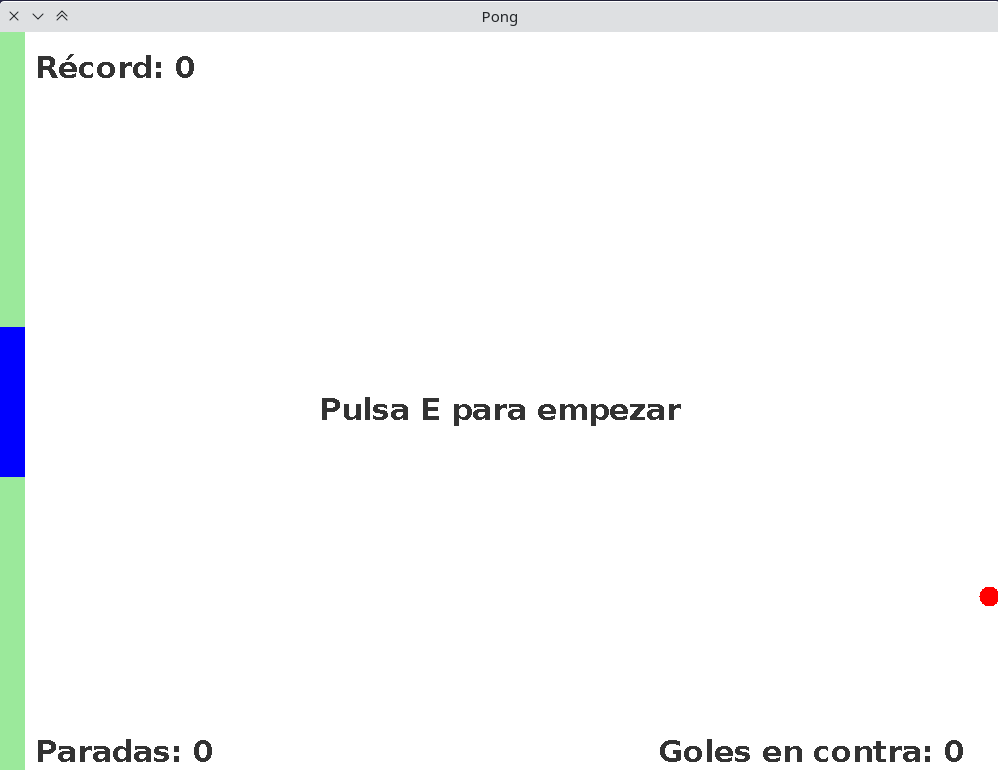

# Pong
Juego de Pong

El típico juego de pong pero en el que se juega contra uno mismo. No hay portería rival sino que cuando la pelota pega en la pared derecha puede cambiar su dirección y velocidad aleatoriamente como si hubiera sido golpeada por un rival imaginario.

El objetivo del juego es batir tu propio récord de número de paradas que se logran (evitar que la bola toque la pared verde de la izquierda).

El juego se controla enteramente por teclado: W/S o flechas para subir o bajar, E para empezar el juego y P para pausarlo/reanudarlo.

